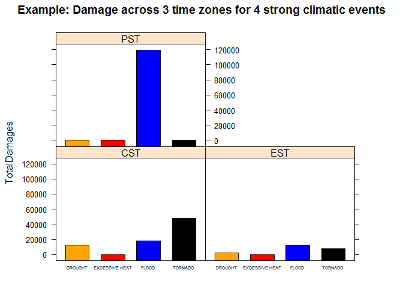

# ClimaticEffects-PA2
SNB  
August 10, 2015  
#Effect of Storms on Costs of Casualties and Material Damage across the USA, 1950-2011.

##SYNOPSIS
This analysis is addressed to city, county or state planners, responsible for including health support and 
property protection measures in their budgets. It is a preliminary survey of the effect of the ten most significant 
climatic factors on human and material damage across the nation and over the 6 decades. 
An illustration is given of how the database may be used to extract more detailed and particular information about 
the particular locality or time zone for the relevant climatic dangers. 
An analysis of the trend over time in these parameters is beyond the scope of present report.

**References:** 

1)  Database:       [National Oceanic and Atomospheric Authority](https://d396qusza40orc.cloudfront.net/repdata%2fdata%2fstormdata.csv.bz2 )

2)  Documentations: [National Weather Service Storm Data Documentation](https://d396qusza40orc.cloudfront.net/repdata%2Fpeer2_doc%2Fpd01016005curr.pdf )

3)  FAQ:            [National Climatic Data Center Storm Events FAQ](https://d396qusza40orc.cloudfront.net/repdata%2Fpeer2_doc%2FNCDC Storm Events-FAQ Page.pdf)


##DATA COLLECTION

Reading the data (for the second time after examining for inconsistencies:


```r
StormData<-read.csv(bzfile("repdata-data-StormData.csv.bz2","rt"),header=TRUE, na.strings=c("","+","?","-"), stringsAsFactors=FALSE)
```
**Summarising the data:**


```r
dim(StormData)
```

```
## [1] 902297     37
```

```r
names(StormData)
```

```
##  [1] "STATE__"    "BGN_DATE"   "BGN_TIME"   "TIME_ZONE"  "COUNTY"    
##  [6] "COUNTYNAME" "STATE"      "EVTYPE"     "BGN_RANGE"  "BGN_AZI"   
## [11] "BGN_LOCATI" "END_DATE"   "END_TIME"   "COUNTY_END" "COUNTYENDN"
## [16] "END_RANGE"  "END_AZI"    "END_LOCATI" "LENGTH"     "WIDTH"     
## [21] "F"          "MAG"        "FATALITIES" "INJURIES"   "PROPDMG"   
## [26] "PROPDMGEXP" "CROPDMG"    "CROPDMGEXP" "WFO"        "STATEOFFIC"
## [31] "ZONENAMES"  "LATITUDE"   "LONGITUDE"  "LATITUDE_E" "LONGITUDE_"
## [36] "REMARKS"    "REFNUM"
```

```r
head(StormData)
```

```
##   STATE__           BGN_DATE BGN_TIME TIME_ZONE COUNTY COUNTYNAME STATE
## 1       1  4/18/1950 0:00:00     0130       CST     97     MOBILE    AL
## 2       1  4/18/1950 0:00:00     0145       CST      3    BALDWIN    AL
## 3       1  2/20/1951 0:00:00     1600       CST     57    FAYETTE    AL
## 4       1   6/8/1951 0:00:00     0900       CST     89    MADISON    AL
## 5       1 11/15/1951 0:00:00     1500       CST     43    CULLMAN    AL
## 6       1 11/15/1951 0:00:00     2000       CST     77 LAUDERDALE    AL
##    EVTYPE BGN_RANGE BGN_AZI BGN_LOCATI END_DATE END_TIME COUNTY_END
## 1 TORNADO         0    <NA>       <NA>     <NA>     <NA>          0
## 2 TORNADO         0    <NA>       <NA>     <NA>     <NA>          0
## 3 TORNADO         0    <NA>       <NA>     <NA>     <NA>          0
## 4 TORNADO         0    <NA>       <NA>     <NA>     <NA>          0
## 5 TORNADO         0    <NA>       <NA>     <NA>     <NA>          0
## 6 TORNADO         0    <NA>       <NA>     <NA>     <NA>          0
##   COUNTYENDN END_RANGE END_AZI END_LOCATI LENGTH WIDTH F MAG FATALITIES
## 1         NA         0    <NA>       <NA>   14.0   100 3   0          0
## 2         NA         0    <NA>       <NA>    2.0   150 2   0          0
## 3         NA         0    <NA>       <NA>    0.1   123 2   0          0
## 4         NA         0    <NA>       <NA>    0.0   100 2   0          0
## 5         NA         0    <NA>       <NA>    0.0   150 2   0          0
## 6         NA         0    <NA>       <NA>    1.5   177 2   0          0
##   INJURIES PROPDMG PROPDMGEXP CROPDMG CROPDMGEXP  WFO STATEOFFIC ZONENAMES
## 1       15    25.0          K       0       <NA> <NA>       <NA>      <NA>
## 2        0     2.5          K       0       <NA> <NA>       <NA>      <NA>
## 3        2    25.0          K       0       <NA> <NA>       <NA>      <NA>
## 4        2     2.5          K       0       <NA> <NA>       <NA>      <NA>
## 5        2     2.5          K       0       <NA> <NA>       <NA>      <NA>
## 6        6     2.5          K       0       <NA> <NA>       <NA>      <NA>
##   LATITUDE LONGITUDE LATITUDE_E LONGITUDE_ REMARKS REFNUM
## 1     3040      8812       3051       8806    <NA>      1
## 2     3042      8755          0          0    <NA>      2
## 3     3340      8742          0          0    <NA>      3
## 4     3458      8626          0          0    <NA>      4
## 5     3412      8642          0          0    <NA>      5
## 6     3450      8748          0          0    <NA>      6
```

```r
str(StormData)
```

```
## 'data.frame':	902297 obs. of  37 variables:
##  $ STATE__   : num  1 1 1 1 1 1 1 1 1 1 ...
##  $ BGN_DATE  : chr  "4/18/1950 0:00:00" "4/18/1950 0:00:00" "2/20/1951 0:00:00" "6/8/1951 0:00:00" ...
##  $ BGN_TIME  : chr  "0130" "0145" "1600" "0900" ...
##  $ TIME_ZONE : chr  "CST" "CST" "CST" "CST" ...
##  $ COUNTY    : num  97 3 57 89 43 77 9 123 125 57 ...
##  $ COUNTYNAME: chr  "MOBILE" "BALDWIN" "FAYETTE" "MADISON" ...
##  $ STATE     : chr  "AL" "AL" "AL" "AL" ...
##  $ EVTYPE    : chr  "TORNADO" "TORNADO" "TORNADO" "TORNADO" ...
##  $ BGN_RANGE : num  0 0 0 0 0 0 0 0 0 0 ...
##  $ BGN_AZI   : chr  NA NA NA NA ...
##  $ BGN_LOCATI: chr  NA NA NA NA ...
##  $ END_DATE  : chr  NA NA NA NA ...
##  $ END_TIME  : chr  NA NA NA NA ...
##  $ COUNTY_END: num  0 0 0 0 0 0 0 0 0 0 ...
##  $ COUNTYENDN: logi  NA NA NA NA NA NA ...
##  $ END_RANGE : num  0 0 0 0 0 0 0 0 0 0 ...
##  $ END_AZI   : chr  NA NA NA NA ...
##  $ END_LOCATI: chr  NA NA NA NA ...
##  $ LENGTH    : num  14 2 0.1 0 0 1.5 1.5 0 3.3 2.3 ...
##  $ WIDTH     : num  100 150 123 100 150 177 33 33 100 100 ...
##  $ F         : int  3 2 2 2 2 2 2 1 3 3 ...
##  $ MAG       : num  0 0 0 0 0 0 0 0 0 0 ...
##  $ FATALITIES: num  0 0 0 0 0 0 0 0 1 0 ...
##  $ INJURIES  : num  15 0 2 2 2 6 1 0 14 0 ...
##  $ PROPDMG   : num  25 2.5 25 2.5 2.5 2.5 2.5 2.5 25 25 ...
##  $ PROPDMGEXP: chr  "K" "K" "K" "K" ...
##  $ CROPDMG   : num  0 0 0 0 0 0 0 0 0 0 ...
##  $ CROPDMGEXP: chr  NA NA NA NA ...
##  $ WFO       : chr  NA NA NA NA ...
##  $ STATEOFFIC: chr  NA NA NA NA ...
##  $ ZONENAMES : chr  NA NA NA NA ...
##  $ LATITUDE  : num  3040 3042 3340 3458 3412 ...
##  $ LONGITUDE : num  8812 8755 8742 8626 8642 ...
##  $ LATITUDE_E: num  3051 0 0 0 0 ...
##  $ LONGITUDE_: num  8806 0 0 0 0 ...
##  $ REMARKS   : chr  NA NA NA NA ...
##  $ REFNUM    : num  1 2 3 4 5 6 7 8 9 10 ...
```

```r
summary(StormData)
```

```
##     STATE__       BGN_DATE           BGN_TIME          TIME_ZONE        
##  Min.   : 1.0   Length:902297      Length:902297      Length:902297     
##  1st Qu.:19.0   Class :character   Class :character   Class :character  
##  Median :30.0   Mode  :character   Mode  :character   Mode  :character  
##  Mean   :31.2                                                           
##  3rd Qu.:45.0                                                           
##  Max.   :95.0                                                           
##                                                                         
##      COUNTY       COUNTYNAME           STATE              EVTYPE         
##  Min.   :  0.0   Length:902297      Length:902297      Length:902297     
##  1st Qu.: 31.0   Class :character   Class :character   Class :character  
##  Median : 75.0   Mode  :character   Mode  :character   Mode  :character  
##  Mean   :100.6                                                           
##  3rd Qu.:131.0                                                           
##  Max.   :873.0                                                           
##                                                                          
##    BGN_RANGE          BGN_AZI           BGN_LOCATI       
##  Min.   :   0.000   Length:902297      Length:902297     
##  1st Qu.:   0.000   Class :character   Class :character  
##  Median :   0.000   Mode  :character   Mode  :character  
##  Mean   :   1.484                                        
##  3rd Qu.:   1.000                                        
##  Max.   :3749.000                                        
##                                                          
##    END_DATE           END_TIME           COUNTY_END COUNTYENDN    
##  Length:902297      Length:902297      Min.   :0    Mode:logical  
##  Class :character   Class :character   1st Qu.:0    NA's:902297   
##  Mode  :character   Mode  :character   Median :0                  
##                                        Mean   :0                  
##                                        3rd Qu.:0                  
##                                        Max.   :0                  
##                                                                   
##    END_RANGE          END_AZI           END_LOCATI       
##  Min.   :  0.0000   Length:902297      Length:902297     
##  1st Qu.:  0.0000   Class :character   Class :character  
##  Median :  0.0000   Mode  :character   Mode  :character  
##  Mean   :  0.9862                                        
##  3rd Qu.:  0.0000                                        
##  Max.   :925.0000                                        
##                                                          
##      LENGTH              WIDTH                F               MAG         
##  Min.   :   0.0000   Min.   :   0.000   Min.   :0.0      Min.   :    0.0  
##  1st Qu.:   0.0000   1st Qu.:   0.000   1st Qu.:0.0      1st Qu.:    0.0  
##  Median :   0.0000   Median :   0.000   Median :1.0      Median :   50.0  
##  Mean   :   0.2301   Mean   :   7.503   Mean   :0.9      Mean   :   46.9  
##  3rd Qu.:   0.0000   3rd Qu.:   0.000   3rd Qu.:1.0      3rd Qu.:   75.0  
##  Max.   :2315.0000   Max.   :4400.000   Max.   :5.0      Max.   :22000.0  
##                                         NA's   :843563                    
##    FATALITIES          INJURIES            PROPDMG       
##  Min.   :  0.0000   Min.   :   0.0000   Min.   :   0.00  
##  1st Qu.:  0.0000   1st Qu.:   0.0000   1st Qu.:   0.00  
##  Median :  0.0000   Median :   0.0000   Median :   0.00  
##  Mean   :  0.0168   Mean   :   0.1557   Mean   :  12.06  
##  3rd Qu.:  0.0000   3rd Qu.:   0.0000   3rd Qu.:   0.50  
##  Max.   :583.0000   Max.   :1700.0000   Max.   :5000.00  
##                                                          
##   PROPDMGEXP           CROPDMG         CROPDMGEXP       
##  Length:902297      Min.   :  0.000   Length:902297     
##  Class :character   1st Qu.:  0.000   Class :character  
##  Mode  :character   Median :  0.000   Mode  :character  
##                     Mean   :  1.527                     
##                     3rd Qu.:  0.000                     
##                     Max.   :990.000                     
##                                                         
##      WFO             STATEOFFIC         ZONENAMES            LATITUDE   
##  Length:902297      Length:902297      Length:902297      Min.   :   0  
##  Class :character   Class :character   Class :character   1st Qu.:2802  
##  Mode  :character   Mode  :character   Mode  :character   Median :3540  
##                                                           Mean   :2875  
##                                                           3rd Qu.:4019  
##                                                           Max.   :9706  
##                                                           NA's   :47    
##    LONGITUDE        LATITUDE_E     LONGITUDE_       REMARKS         
##  Min.   :-14451   Min.   :   0   Min.   :-14455   Length:902297     
##  1st Qu.:  7247   1st Qu.:   0   1st Qu.:     0   Class :character  
##  Median :  8707   Median :   0   Median :     0   Mode  :character  
##  Mean   :  6940   Mean   :1452   Mean   :  3509                     
##  3rd Qu.:  9605   3rd Qu.:3549   3rd Qu.:  8735                     
##  Max.   : 17124   Max.   :9706   Max.   :106220                     
##                   NA's   :40                                        
##      REFNUM      
##  Min.   :     1  
##  1st Qu.:225575  
##  Median :451149  
##  Mean   :451149  
##  3rd Qu.:676723  
##  Max.   :902297  
## 
```

```r
summary(as.factor(StormData$TIME_ZONE))
```

```
##    ADT    AKS    AST    CDT    CSC    CSt    CST    EDT    ESt    EST 
##      3   1553   6360    692      1      4 547493    569      2 245558 
##    ESY    GMT    GST    HST    MDT    MST    PDT    PST    SCT    SST 
##      1      1     32   2563     99  68390    154  28302      2    505 
##    UNK    UTC 
##      9      4
```

```r
summary(as.factor(StormData$EVTYPE))
```

```
##                     HAIL                TSTM WIND        THUNDERSTORM WIND 
##                   288661                   219940                    82563 
##                  TORNADO              FLASH FLOOD                    FLOOD 
##                    60652                    54277                    25326 
##       THUNDERSTORM WINDS                HIGH WIND                LIGHTNING 
##                    20843                    20212                    15754 
##               HEAVY SNOW               HEAVY RAIN             WINTER STORM 
##                    15708                    11723                    11433 
##           WINTER WEATHER             FUNNEL CLOUD         MARINE TSTM WIND 
##                     7026                     6839                     6175 
## MARINE THUNDERSTORM WIND               WATERSPOUT              STRONG WIND 
##                     5812                     3796                     3566 
##     URBAN/SML STREAM FLD                 WILDFIRE                 BLIZZARD 
##                     3392                     2761                     2719 
##                  DROUGHT                ICE STORM           EXCESSIVE HEAT 
##                     2488                     2006                     1678 
##               HIGH WINDS         WILD/FOREST FIRE             FROST/FREEZE 
##                     1533                     1457                     1342 
##                DENSE FOG       WINTER WEATHER/MIX           TSTM WIND/HAIL 
##                     1293                     1104                     1028 
##  EXTREME COLD/WIND CHILL                     HEAT                HIGH SURF 
##                     1002                      767                      725 
##           TROPICAL STORM           FLASH FLOODING             EXTREME COLD 
##                      690                      682                      655 
##            COASTAL FLOOD         LAKE-EFFECT SNOW        FLOOD/FLASH FLOOD 
##                      650                      636                      624 
##                LANDSLIDE                     SNOW          COLD/WIND CHILL 
##                      600                      587                      539 
##                      FOG              RIP CURRENT              MARINE HAIL 
##                      538                      470                      442 
##               DUST STORM                AVALANCHE                     WIND 
##                      427                      386                      340 
##             RIP CURRENTS              STORM SURGE            FREEZING RAIN 
##                      304                      261                      250 
##              URBAN FLOOD     HEAVY SURF/HIGH SURF        EXTREME WINDCHILL 
##                      249                      228                      204 
##             STRONG WINDS           DRY MICROBURST    ASTRONOMICAL LOW TIDE 
##                      196                      186                      174 
##                HURRICANE              RIVER FLOOD               LIGHT SNOW 
##                      174                      173                      154 
##         STORM SURGE/TIDE            RECORD WARMTH         COASTAL FLOODING 
##                      148                      146                      143 
##               DUST DEVIL         MARINE HIGH WIND        UNSEASONABLY WARM 
##                      141                      135                      126 
##                 FLOODING   ASTRONOMICAL HIGH TIDE        MODERATE SNOWFALL 
##                      120                      103                      101 
##           URBAN FLOODING               WINTRY MIX        HURRICANE/TYPHOON 
##                       98                       90                       88 
##            FUNNEL CLOUDS               HEAVY SURF              RECORD HEAT 
##                       87                       84                       81 
##                   FREEZE                HEAT WAVE                     COLD 
##                       74                       74                       72 
##              RECORD COLD                      ICE  THUNDERSTORM WINDS HAIL 
##                       64                       61                       61 
##      TROPICAL DEPRESSION                    SLEET         UNSEASONABLY DRY 
##                       60                       59                       56 
##                    FROST              GUSTY WINDS      THUNDERSTORM WINDSS 
##                       53                       53                       51 
##       MARINE STRONG WIND                    OTHER               SMALL HAIL 
##                       48                       48                       47 
##                   FUNNEL             FREEZING FOG             THUNDERSTORM 
##                       46                       45                       45 
##       Temperature record          TSTM WIND (G45)         Coastal Flooding 
##                       43                       39                       38 
##              WATERSPOUTS    MONTHLY PRECIPITATION                  (Other) 
##                       37                       36                     2975 
##                     NA's 
##                        1
```

```r
summary(as.factor(StormData$PROPDMGEXP))
```

```
##      0      1      2      3      4      5      6      7      8      B 
##    216     25     13      4      4     28      4      5      1     40 
##      h      H      K      m      M   NA's 
##      1      6 424665      7  11330 465948
```

```r
summary(as.factor(StormData$CROPDMGEXP))
```

```
##      0      2      B      k      K      m      M   NA's 
##     19      1      9     21 281832      1   1994 618420
```

```r
summary(as.factor(StormData$TIME_ZONE))
```

```
##    ADT    AKS    AST    CDT    CSC    CSt    CST    EDT    ESt    EST 
##      3   1553   6360    692      1      4 547493    569      2 245558 
##    ESY    GMT    GST    HST    MDT    MST    PDT    PST    SCT    SST 
##      1      1     32   2563     99  68390    154  28302      2    505 
##    UNK    UTC 
##      9      4
```

##DATA PROCESSING

**DATA EXTRACTION**

Extracting the relevant data (10 columns taken from the original database) :
    The data BGN_DATA(column 2), time zone TIME_ZONE (column 4)state STATE (column 7), 
    event type EVTYPE (column 8), fatalities FATALITIES (column 23), injuries INJURIES (column 24),
    property damage PROPDMG (column 25), the corresponding dollar units PROPDMGEXP (column 26),
    crop damage CROPDMG (column 27) and the corresponding dollar units CROPDMGEXP (column 28)
    The LATITUDE and LONGITUDE data (columns 32,33) are also included, 
    in case these were more useful parameters than the time zone.
    

```r
sdata <- StormData[,c(2,4,7,8,23,24,25,26,27,28,32,33)]
len   <-length(StormData$EVTYPE)
```
**INITIALISING with the required packets in R:**


```r
library(stringr)
library(ggplot2)
library(lattice)
library(dplyr)
```

```
## 
## Attaching package: 'dplyr'
## 
## The following object is masked from 'package:stats':
## 
##     filter
## 
## The following objects are masked from 'package:base':
## 
##     intersect, setdiff, setequal, union
```
**CLEANING up some observed anomalies in the EVTYPE data (no doubt many more to be found under "others"):**


```r
sdata$EVTYPE <- sapply(sdata$EVTYPE, function(x) toupper(x))
sdata$EVTYPE[sdata$EVTYPE=="AVALANCE"] <- "AVALANCHE"
sdata$EVTYPE[sdata$EVTYPE=="COASTALSTORM"] <- "COASTAL STORM"
```

###PROCESSING OF CASUALTY DATA

**PREPARING SUMMARIES OF CASUALTIES**

Forming tables of non-zero casualties

```r
casualties <- select(sdata, TIME_ZONE,EVTYPE, FATALITIES, INJURIES)
casualties <- filter(casualties, FATALITIES !=0 | INJURIES !=0)
lcas <-length(casualties$EVTYPE)

cat("There are a total of ",lcas, " non-zero records of casualties.")
```

```
## There are a total of  21929  non-zero records of casualties.
```

**ARRANGING the death, injury and total casualty data by type of weather event and the time zone**


```r
LossAsCasualties <- group_by(casualties, EVTYPE, TIME_ZONE) %>%
                    summarize(Fatalities = sum(FATALITIES, na.rm=TRUE),
                              Injuries = sum(INJURIES, na.rm=TRUE),
                              TotalCasualties = Fatalities + Injuries)
```
**COMPRESSING the casualty data to the national plane:**

```r
LAC <-group_by(LossAsCasualties,EVTYPE)%>%
      summarise(National_Deaths= sum(Fatalities), 
                National_Injuries=sum(Injuries), 
                National_Casualties=sum(TotalCasualties))
LACd <-arrange(LAC,desc(National_Deaths))
LACi <-arrange(LAC,desc(National_Injuries))
LACt <-arrange(LAC,desc(National_Casualties))
Death_shortlist<-head(LACd,10)
Injuries_shortlist<-head(LACi,10)
Casualties_shortlist<-head(LACt,10)
```


##RESULTS FOR CASUALTIES on the national plane


The data on the human losses as deaths and injuries are produced in the following table and  barplots:

**National Statistics on Principle Causes of Deaths - 1950-2011**

```r
Death_shortlist
```

```
## Source: local data frame [10 x 4]
## 
##            EVTYPE National_Deaths National_Injuries National_Casualties
## 1         TORNADO            5633             91346               96979
## 2  EXCESSIVE HEAT            1903              6525                8428
## 3     FLASH FLOOD             978              1777                2755
## 4            HEAT             937              2100                3037
## 5       LIGHTNING             816              5230                6046
## 6       TSTM WIND             504              6957                7461
## 7           FLOOD             470              6789                7259
## 8     RIP CURRENT             368               232                 600
## 9       HIGH WIND             248              1137                1385
## 10      AVALANCHE             225               170                 395
```
**National Statistics on Principle Causes of Injuries - 1950-2011**

```r
Injuries_shortlist
```

```
## Source: local data frame [10 x 4]
## 
##               EVTYPE National_Deaths National_Injuries National_Casualties
## 1            TORNADO            5633             91346               96979
## 2          TSTM WIND             504              6957                7461
## 3              FLOOD             470              6789                7259
## 4     EXCESSIVE HEAT            1903              6525                8428
## 5          LIGHTNING             816              5230                6046
## 6               HEAT             937              2100                3037
## 7          ICE STORM              89              1975                2064
## 8        FLASH FLOOD             978              1777                2755
## 9  THUNDERSTORM WIND             133              1488                1621
## 10              HAIL              15              1361                1376
```
**National Statistics on Principle Causes of Caualties - 1950-2011**

```r
Casualties_shortlist
```

```
## Source: local data frame [10 x 4]
## 
##               EVTYPE National_Deaths National_Injuries National_Casualties
## 1            TORNADO            5633             91346               96979
## 2     EXCESSIVE HEAT            1903              6525                8428
## 3          TSTM WIND             504              6957                7461
## 4              FLOOD             470              6789                7259
## 5          LIGHTNING             816              5230                6046
## 6               HEAT             937              2100                3037
## 7        FLASH FLOOD             978              1777                2755
## 8          ICE STORM              89              1975                2064
## 9  THUNDERSTORM WIND             133              1488                1621
## 10      WINTER STORM             206              1321                1527
```

```r
par(mfrow=c(1,3), mar = c(15,4,6,1), cex=0.75)

barplot(Death_shortlist$National_Deaths, las=3, names.arg = Death_shortlist$EVTYPE,
        ylab="All deaths",col="red")
barplot(Injuries_shortlist$National_Injuries, las=3, names.arg = Injuries_shortlist$EVTYPE,
        main="The ten main causes of \ndeaths and injuries \nacross USA - 1950-2011",
        ylab="All injuries", col="orange")
barplot(Casualties_shortlist$National_Casualties, las=3, names.arg = Casualties_shortlist$EVTYPE,
        ylab="All casualties", col="black")
```

 


###PROCESSING OF MATERIAL LOSS DATA

**PREPARING SUMMARIES OF MATERIAL DAMAGE (property and crop damage)**

Forming tables of non-zero damage

```r
damages <- select(sdata, TIME_ZONE,EVTYPE, PROPDMG, PROPDMGEXP, CROPDMG, CROPDMGEXP)
damages <- filter(damages, PROPDMG !=0 | CROPDMG !=0)
damages$PROPDMGEXP <- sapply(damages$PROPDMGEXP, function(x) toupper(x))
damages$CROPDMGEXP <- sapply(damages$CROPDMGEXP, function(x) toupper(x))
ldam <-length(damages$EVTYPE)

cat("There are a total of ", ldam, "non-zero records of material costs")
```

```
## There are a total of  245031 non-zero records of material costs
```

**CONVERTING costs to the common unit, million dollars.**

```r
summary(as.factor(damages$PROPDMGEXP))
```

```
##      0      2      3      4      5      6      7      B      H      K 
##    209      1      1      4     18      3      2     40      7 229057 
##      M   NA's 
##  11326   4363
```

```r
summary(as.factor(damages$CROPDMGEXP))
```

```
##      0      B      K      M   NA's 
##     17      7  97981   1983 145043
```

```r
damages$PROPDMGEXP[damages$PROPDMGEXP=="H"] <- "2"
damages$PROPDMGEXP[damages$PROPDMGEXP=="K"] <- "3"
damages$PROPDMGEXP[damages$PROPDMGEXP=="M"] <- "6"
damages$PROPDMGEXP[damages$PROPDMGEXP=="B"] <- "9"
damages$CROPDMGEXP[damages$CROPDMGEXP=="K"] <- "3"
damages$CROPDMGEXP[damages$CROPDMGEXP=="M"] <- "6"
damages$CROPDMGEXP[damages$CROPDMGEXP=="B"] <- "9"

summary(as.factor(damages$PROPDMGEXP))
```

```
##      0      2      3      4      5      6      7      9   NA's 
##    209      8 229058      4     18  11329      2     40   4363
```

```r
summary(as.factor(damages$CROPDMGEXP))
```

```
##      0      3      6      9   NA's 
##     17  97981   1983      7 145043
```

```r
damages$PROPDMGEXP <- as.integer(damages$PROPDMGEXP)
damages$CROPDMGEXP <- as.integer(damages$CROPDMGEXP)

damages$PROPDMG <- damages$PROPDMG * 10**(damages$PROPDMGEXP-6)
damages$CROPDMG <- damages$CROPDMG * 10**(damages$CROPDMGEXP-6)

summary(damages$PROPDMG)
```

```
##     Min.  1st Qu.   Median     Mean  3rd Qu.     Max.     NA's 
## 0.00e+00 0.00e+00 1.00e-02 1.78e+00 5.00e-02 1.15e+05     4363
```

```r
summary(damages$CROPDMG)
```

```
##    Min. 1st Qu.  Median    Mean 3rd Qu.    Max.    NA's 
##    0.00    0.00    0.00    0.49    0.00 5000.00  145043
```
**ARRANGING the property, crop and total material loss data by type of weather event and the time zone**


```r
LossAsDamages <- group_by(damages, EVTYPE, TIME_ZONE) %>%
                    summarize(PropertyDamages = sum(PROPDMG, na.rm=TRUE),
                              CropDamages = sum(CROPDMG, na.rm=TRUE),
                              TotalDamages = PropertyDamages + CropDamages)
```
**COMPRESSING the damages data to the national plane:**

```r
LAD <-group_by(LossAsDamages,EVTYPE)%>%
      summarise(Property_Loss = sum(PropertyDamages), 
                Crop_Loss=sum(CropDamages), 
                Damages=sum(TotalDamages))
LADP <-arrange(LAD,desc(Property_Loss))
LADC <-arrange(LAD,desc(Crop_Loss))
LADT <-arrange(LAD,desc(Damages))
Property_shortlist<-head(LADP,10)
Crop_shortlist<-head(LADC,10)
Damages_shortlist<-head(LADT,10)
```

##RESULTS FOR MATERIAL LOSSES on the national plane

The data on the material damages as property and crops losses are produced in the following table and  barplots:

**National Statistics on Principle Causes of Property Damages - 1950-2011**

```r
Property_shortlist
```

```
## Source: local data frame [10 x 4]
## 
##               EVTYPE Property_Loss Crop_Loss    Damages
## 1              FLOOD    144657.710 5661.9685 150319.678
## 2  HURRICANE/TYPHOON     69305.840 2607.8728  71913.713
## 3            TORNADO     56947.381  414.9533  57362.334
## 4        STORM SURGE     43323.536    0.0050  43323.541
## 5        FLASH FLOOD     16822.674 1421.3171  18243.991
## 6               HAIL     15735.267 3025.9545  18761.222
## 7          HURRICANE     11868.319 2741.9100  14610.229
## 8     TROPICAL STORM      7703.891  678.3460   8382.237
## 9       WINTER STORM      6688.497   26.9440   6715.441
## 10         HIGH WIND      5270.046  638.5713   5908.618
```
**National Statistics on Principle Causes of Crop Damages - 1950-2011**

```r
Crop_shortlist
```

```
## Source: local data frame [10 x 4]
## 
##               EVTYPE Property_Loss Crop_Loss    Damages
## 1            DROUGHT     1046.1060 13972.566  15018.672
## 2              FLOOD   144657.7098  5661.968 150319.678
## 3        RIVER FLOOD     5118.9455  5029.459  10148.405
## 4          ICE STORM     3944.9279  5022.113   8967.041
## 5               HAIL    15735.2675  3025.954  18761.222
## 6          HURRICANE    11868.3190  2741.910  14610.229
## 7  HURRICANE/TYPHOON    69305.8400  2607.873  71913.713
## 8        FLASH FLOOD    16822.6738  1421.317  18243.991
## 9       EXTREME COLD       67.7374  1312.973   1380.710
## 10      FROST/FREEZE       10.4800  1094.186   1104.666
```
**National Statistics on Principle Causes of Material Losses - 1950-2011**

```r
Damages_shortlist
```

```
## Source: local data frame [10 x 4]
## 
##               EVTYPE Property_Loss  Crop_Loss    Damages
## 1              FLOOD    144657.710  5661.9685 150319.678
## 2  HURRICANE/TYPHOON     69305.840  2607.8728  71913.713
## 3            TORNADO     56947.381   414.9533  57362.334
## 4        STORM SURGE     43323.536     0.0050  43323.541
## 5               HAIL     15735.267  3025.9545  18761.222
## 6        FLASH FLOOD     16822.674  1421.3171  18243.991
## 7            DROUGHT      1046.106 13972.5660  15018.672
## 8          HURRICANE     11868.319  2741.9100  14610.229
## 9        RIVER FLOOD      5118.945  5029.4590  10148.405
## 10         ICE STORM      3944.928  5022.1135   8967.041
```

```r
par(mfrow=c(1,3), mar = c(15,4,6,1), cex=0.75)

barplot(Property_shortlist$Property_Loss, las=3, names.arg = Property_shortlist$EVTYPE,
        ylab="All property losses", col="blue")
barplot(Crop_shortlist$Crop_Loss, las=3, names.arg = Crop_shortlist$EVTYPE,
        main="The ten main factors \naffecting economic loss \nacross USA - 1950-2011 \n(million dollars)",
        ylab="All rop losses",col="green")
barplot(Damages_shortlist$Damages, las=3, names.arg = Damages_shortlist$EVTYPE,
        ylab="All material losses",col="brown")
```

 


##PROCESSING of data for the MAJOR CLIMATIC FACTORS affecting casualities and damages for selected TIME ZONES

###Investigating the patterns over time zones for the six main climatic events


```r
casualties_timezone<-filter(LossAsCasualties,EVTYPE=="TYPHOON"|EVTYPE== "FLOOD"|EVTYPE=="TORNADO"|EVTYPE=="DROUGHT"|EVTYPE=="EXCESSIVE HEAT")
damages_timezone   <-filter(LossAsDamages,EVTYPE=="TYPHOON"|EVTYPE== "FLOOD"|EVTYPE=="TORNADO"|EVTYPE=="DROUGHT"|EVTYPE=="EXCESSIVE HEAT")
head(casualties_timezone, 40)
```

```
## Source: local data frame [22 x 5]
## Groups: EVTYPE
## 
##            EVTYPE TIME_ZONE Fatalities Injuries TotalCasualties
## 1         DROUGHT       CST          0        4               4
## 2  EXCESSIVE HEAT       AST          1        0               1
## 3  EXCESSIVE HEAT       CST       1040     4189            5229
## 4  EXCESSIVE HEAT       EST        678     2076            2754
## 5  EXCESSIVE HEAT       MST         59        0              59
## 6  EXCESSIVE HEAT       PST        125      260             385
## 7           FLOOD       AST          9        2              11
## 8           FLOOD       CST        158     6517            6675
## 9           FLOOD       EDT          1        0               1
## 10          FLOOD       EST        240      172             412
## ..            ...       ...        ...      ...             ...
```

```r
summary(as.factor(casualties_timezone$TIME_ZONE))
```

```
## AST CDT CST EDT EST HST MST PST SST 
##   2   1   4   2   3   2   3   3   2
```

```r
head(damages_timezone, 40)
```

```
## Source: local data frame [37 x 5]
## Groups: EVTYPE
## 
##            EVTYPE TIME_ZONE PropertyDamages CropDamages TotalDamages
## 1         DROUGHT       AST          5.0000       0.200       5.2000
## 2         DROUGHT       CST       1027.0510   11568.273   12595.3240
## 3         DROUGHT       EST          0.0050    2366.003    2366.0080
## 4         DROUGHT       HST          0.0000       0.100       0.1000
## 5         DROUGHT       MST          2.0000      15.390      17.3900
## 6         DROUGHT       PST         12.0500      22.600      34.6500
## 7  EXCESSIVE HEAT       CST          7.5537       0.000       7.5537
## 8  EXCESSIVE HEAT       EST          0.0300       0.000       0.0300
## 9  EXCESSIVE HEAT       PST          0.1700     492.402     492.5720
## 10          FLOOD       AKS         84.4966       0.000      84.4966
## ..            ...       ...             ...         ...          ...
```

```r
summary(as.factor(damages_timezone$TIME_ZONE))
```

```
## AKS AST CDT CSC CST EDT EST GMT GST HST MDT MST PDT PST SST UNK 
##   1   3   2   1   4   2   4   1   1   4   1   3   2   5   2   1
```

###Selecting the maximum number of time zones to give enough data for comparison


```r
casualties_4zones<-filter(casualties_timezone,TIME_ZONE=="PST"|TIME_ZONE=="CST"|TIME_ZONE=="MST"|TIME_ZONE=="EST")
damages_3zones<-filter(damages_timezone,TIME_ZONE=="PST"|TIME_ZONE=="CST"|TIME_ZONE=="EST")

head(casualties_4zones,20)
```

```
## Source: local data frame [13 x 5]
## Groups: EVTYPE
## 
##            EVTYPE TIME_ZONE Fatalities Injuries TotalCasualties
## 1         DROUGHT       CST          0        4               4
## 2  EXCESSIVE HEAT       CST       1040     4189            5229
## 3  EXCESSIVE HEAT       EST        678     2076            2754
## 4  EXCESSIVE HEAT       MST         59        0              59
## 5  EXCESSIVE HEAT       PST        125      260             385
## 6           FLOOD       CST        158     6517            6675
## 7           FLOOD       EST        240      172             412
## 8           FLOOD       MST         10       14              24
## 9           FLOOD       PST         52       83             135
## 10        TORNADO       CST       5180    81524           86704
## 11        TORNADO       EST        440     9253            9693
## 12        TORNADO       MST         11      434             445
## 13        TORNADO       PST          0       27              27
```

```r
head(damages_3zones,20)
```

```
## Source: local data frame [13 x 5]
## Groups: EVTYPE
## 
##            EVTYPE TIME_ZONE PropertyDamages CropDamages TotalDamages
## 1         DROUGHT       CST      1027.05100 11568.27300  12595.32400
## 2         DROUGHT       EST         0.00500  2366.00300   2366.00800
## 3         DROUGHT       PST        12.05000    22.60000     34.65000
## 4  EXCESSIVE HEAT       CST         7.55370     0.00000      7.55370
## 5  EXCESSIVE HEAT       EST         0.03000     0.00000      0.03000
## 6  EXCESSIVE HEAT       PST         0.17000   492.40200    492.57200
## 7           FLOOD       CST     14696.75150  3291.25650  17988.00800
## 8           FLOOD       EST     10688.69131  1656.52845  12345.21976
## 9           FLOOD       PST    118416.22750   645.23500 119061.46250
## 10        TORNADO       CST     48079.89616   363.85232  48443.74848
## 11        TORNADO       EST      7908.39596    42.50005   7950.89601
## 12        TORNADO       PST        71.11589     0.74655     71.86244
## 13        TYPHOON       PST         0.40000     0.60000      1.00000
```

```r
casualties_4zones <- casualties_4zones[2:13,]
damages_3zones <- damages_3zones[1:12,]
```

##RESULTS for the selected major climatic events for a few time zones


```r
head(casualties_4zones,20)
```

```
## Source: local data frame [12 x 5]
## Groups: EVTYPE
## 
##            EVTYPE TIME_ZONE Fatalities Injuries TotalCasualties
## 1  EXCESSIVE HEAT       CST       1040     4189            5229
## 2  EXCESSIVE HEAT       EST        678     2076            2754
## 3  EXCESSIVE HEAT       MST         59        0              59
## 4  EXCESSIVE HEAT       PST        125      260             385
## 5           FLOOD       CST        158     6517            6675
## 6           FLOOD       EST        240      172             412
## 7           FLOOD       MST         10       14              24
## 8           FLOOD       PST         52       83             135
## 9         TORNADO       CST       5180    81524           86704
## 10        TORNADO       EST        440     9253            9693
## 11        TORNADO       MST         11      434             445
## 12        TORNADO       PST          0       27              27
```

```r
head(damages_3zones,20)
```

```
## Source: local data frame [12 x 5]
## Groups: EVTYPE
## 
##            EVTYPE TIME_ZONE PropertyDamages CropDamages TotalDamages
## 1         DROUGHT       CST      1027.05100 11568.27300  12595.32400
## 2         DROUGHT       EST         0.00500  2366.00300   2366.00800
## 3         DROUGHT       PST        12.05000    22.60000     34.65000
## 4  EXCESSIVE HEAT       CST         7.55370     0.00000      7.55370
## 5  EXCESSIVE HEAT       EST         0.03000     0.00000      0.03000
## 6  EXCESSIVE HEAT       PST         0.17000   492.40200    492.57200
## 7           FLOOD       CST     14696.75150  3291.25650  17988.00800
## 8           FLOOD       EST     10688.69131  1656.52845  12345.21976
## 9           FLOOD       PST    118416.22750   645.23500 119061.46250
## 10        TORNADO       CST     48079.89616   363.85232  48443.74848
## 11        TORNADO       EST      7908.39596    42.50005   7950.89601
## 12        TORNADO       PST        71.11589     0.74655     71.86244
```

```r
par(mar=c(8,3,8,1))
damages_3zones$TIME_ZONE    <- as.factor(damages_3zones$TIME_ZONE)

barchart(TotalDamages~EVTYPE | TIME_ZONE, damages_3zones,layout=c(2,2),col = c("orange","red","blue","black"),
                                main="Example: Damage across 3 time zones for 4 strong climatic events",
                                scales=list(x=list(cex=0.45)))
```

 


##CONCLUSION

As can be seen, by far the most prominent cause of death and injuries as registered over the whole of USA 
between 1959 and 2011 is associated with tornados, while other factors such as flood and heat related events are of the same 
order of magnitude. 

On the other hand in the same period across the nation, floods have almost doubled the economic damage to property 
due to the other important factors, such as typhoon and tornados, and the pattern is the same for the overall material 
damage. 

In the case of crops, economic loss due to drought is double that due to floods and the other relevant climatic events, 
but crop losses make up a smaller portion of the entire material damage costs.

As is expected, the pattern of losses measured in human or economic terms depends on the time zone (or, more exactly, on the
latitude and longitude) of the observations and varies appreciably from the national pattern.

Whether the patterns over time are influenced by a real trend or by exceptional weather and climate effects can only
be decided after grouping the data by year or decade, and is beyong the scope of this report.
